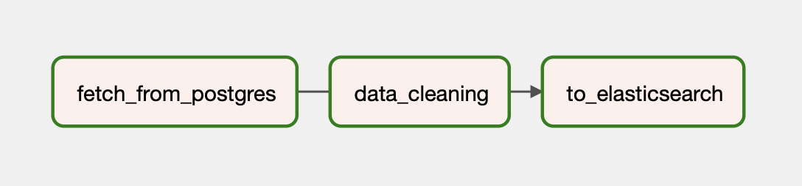

# Data Analysis and Processing of Global Renewable Energy Usage FY 2020-2024

## Repository Outline
1. README.md - About the project
2. DAG.py - Code script for DAG (Directed Acyclic Graph) with task of data processing
3. GX.ipynb - Code script for Great Expectation analysis
5. data_raw.csv - Raw dataset from source
6. data_clean.csv - Data set after cleaning
7. /image - folder contains images of vizulaization using Kibana

## Problem Background
The global shift towards sustainable energy sources has prompted governments and organizations to closely monitor the adoption and usage patterns of renewable energy. However, dataset is often fragmented, inconsistently formatted, and stored in different systems. To support data driven policy making, there is a growing need for automated data pipelines that can extract, clean, and visualize renewable energy usage data and so the analysis and give recommendation. This project aims to build a pipeline using Apache Airflow. Data is fetched from a PostgreSQL database, cleaned and standardized to ensure quality, and then insert into Elasticsearch for visualization with Kibana. Through dashboards, can gain insights into the effectiveness of planning and evaluation of renewable energy programs.

## Project Output
- DAG (Directed Acyclic Graph) built with Apache Airflow.

- Cleaned and validated dataset.
- Vizualization and analysis (recommendation) from data using
[Kibana](/images)

## Data
The dataset used in this project was sourced from Kaggle.com. Dataset contains information on renewable energy adoption and usage by households around the world for year 2020-2024. It provides insights into the growing trend of renewable energy. The dataset format in csv nad has 1000 datas and 12 columns. List of columns:
1. Household_ID: A unique identifier for each household.
2. Region: The geographical region where the household is located
3. Country: The specific country of the household.
4. Energy_Source: The type of renewable energy being used by the household
5. Monthly_Usage_kWh: The monthly energy consumption in kilowatt-hours.
6. Year: The year the data was recorded (2020-2024).
7. Household_Size: The number of people living in the household.
8. Income_Level: The income bracket of the household (Low, Middle, High).
9. Urban_Rural: Whether the household is in an urban or rural area.
10. Adoption_Year: The year the household first adopted renewable energy.
11. Subsidy_Received: Whether the household received any government subsidies (Yes/No).
12. Cost_Savings_USD: The monthly savings in USD due to using renewable energy.

## Method
This project employs Python and its libararies to connect with PostgreSQL, conduct DAG for Apache Airflow and transfer data to ElasticSearch. Using KIbana for data visualization. Python also used for analysis Great Expectation.

## Stacks
The programming language, tools, and Python libraries utilized in this project, including:
- Pandas – used for data manipulation and analysis.
- Psycopg2 - used to connect with PostgreSQL to fetch the data feom database.
- Airflow - used to create DAG and connect with Apache Airflow platform.
- Elasticsearch - used to tranfer data to ElasticSearch, so can use data analysis with Kibana.
- Great Expectations - used for doing data validation and meet expectation.

## Reference
- [Dataset Source](https://www.kaggle.com/datasets/hajraamir21/global-renewable-energy-usage-2020-2024)